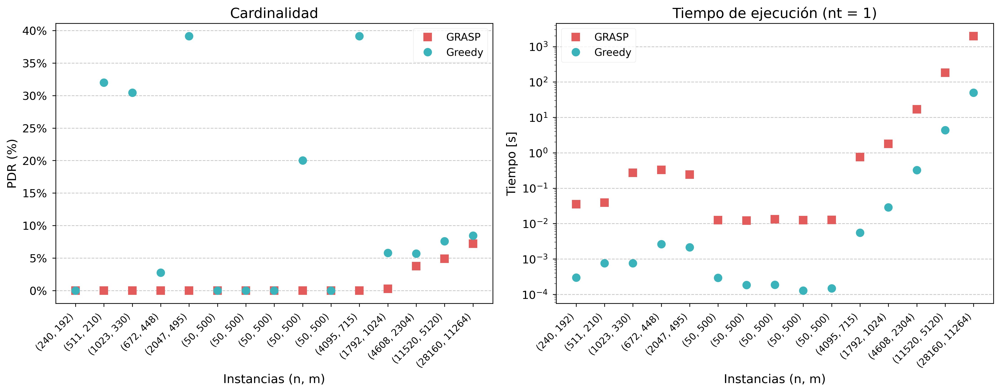

# Aplicación de heurísticas y técnicas de HPC para la segmentación del universo en el Minimum Set Cover Problem

## Instalación
1. Clona el repositorio y dirígete a la rama **grasp**:
    ```bash
    git clone https://github.com/isiIH/mscp.git
    cd mscp
    git switch grasp

## Pasos previos
- Descomprime `test.zip`, que contiene ejemplos extraídos de la OR-Library y datasets generados mediante el archivo `generate_SC_file.py`.
- Crea un archivo llamado `results.txt` en la raíz del proyecto para almacenar los resultados de los experimentos.

## OR-Library
Los datasets ubicados en la carpeta `test/` corresponden a instancias de la **OR-Library**, específicamente de los problemas **Set covering** y **Set partitioning**.

Referencia: 
- [Set covering](https://people.brunel.ac.uk/~mastjjb/jeb/orlib/scpinfo.html)
- [Set Partitioning](https://people.brunel.ac.uk/~mastjjb/jeb/orlib/sppinfo.html)

## Generar datasets aleatorios

Puedes generar datasets personalizados utilizando el archivo `generate_SC_file.py`. 

Dentro del archivo se encuentra la siguiente sección que puedes modificar:

```python
generate_set_cover_file("nombre_archivo", n=100, m=200, num_groups=2)
```

donde:
- nombre_archivo: Nombre base del archivo que se almacenará en la carpeta `test/`. Destacar que al nombre final se le incluirá automáticamente información sobre el número de columnas y grupos (Ej: nombre_archivo_200_2.txt).
- n: Número de elementos del universo.
- m: Número de subconjuntos.
- num_groups: Controla el número de grupos generados, útil para realizar pruebas de segmentación.

## Archivo de configuración

Todas las variables de configuración se encuentran en el archivo `include/config.h`.

- PRINT (0 ó 1): Imprime información principal durante la ejecución.
- CHECK (0 ó 1): Imprime información adicional de los pasos intermedios realizados durante la ejecución.
- TEST (0 ó 1): Guarda información sobre el archivo ejecutado en `result.txt`.
- MAX_RM: 0.5 por default. Indica en porcentaje el máximo número de elementos a eliminar dentro de la solución actual.
- MAX_ITER: 300 por default. Indica el máximo número de iteraciones que realiza GRASP en la fase de mejora.
- GROUP_SEG: Ejecutar sin (0) o con (1) segmentación del universo.
- SEG_TYPE: Si GROUP_SEG = 1, selecciona el método de segmentación, ya sea con UNION-FIND (0) o el método con MST (1).

## Ejecución
Después de haber seteado las variables en `config.h`, compila y ejecuta el programa:

```bash
make
./grasp <filename> <nt>
```

donde:
- filename: Nombre base del archivo almacenado en la carpeta `test/`.
- nt: Número de threads a utilizar.

### Ejemplo

```bash
./grasp rail582 32
```

### Análisis de resultados y experimentos

1. Estructura de los resultados

La información de los experimentos se almacena en el archivo `results.txt` cuando la variable TEST en `include/config.h` está seteada a 1. Cualquier cambio o adicción de información a este archivo se puede realizar en el archivo `main.cpp`.

Cada línea en `results.txt` corresponde a una ejecución completa del programa (`./grasp <filename> <nt>`), con columnas asociadas a una métrica específica, las cuales son descritas en la siguiente tabla:

| Métrica       | Descripción |
|----------     |---------- |
| filename      | Nombre del archivo ejecutado. |
| num_threads   | Número de threads utilizados. |
| n             | Tamaño del universo del problema. |
| m             | Número de subconjuntos del problema. |
| included      | Cantidad de subconjuntos incluidos en la solución en la etapa de preprocesamiento. |
| excluded      | Cantidad de subconjuntos excluidos de la solución en la etapa de preprocesamiento. |
| num_groups    | Número de grupos encontrados durante la segmentación. El valor es de 0 si GROUP_SEG = 0. |
| type          | El método elegido para la segmentación. Los valores son: UF (UNION-FIND), MST o nan (Cuando GROUP_SEG = 0). |
| greedy_time   | Tiempo de ejecución total en segundos del algoritmo Greedy. |
| greedy_size   | Tamaño de la solución Greedy. |
| grasp_time    | Tiempo de ejecución total en segundos del algoritmo propuesto. |
| grasp_size    | Tamaño de la solución del algoritmo propuesto. |

2. Análisis y creación de gráficos

Para procesar y visualizar los resultados, se recomienda utilizar como base el notebook `exp.ipynb`, el cual contiene ejemplos creados durante el desarrollo del artículo de investigación. Este archivo permite:

- Lectura del archivo `results.txt` usando pandas para generar un DataFrame.
- Generación de gráficos y análisis comparativos entre Greedy y GRASP utilizando matplotlib.
- Guardado automático de las imágenes en la carpeta `images/`

